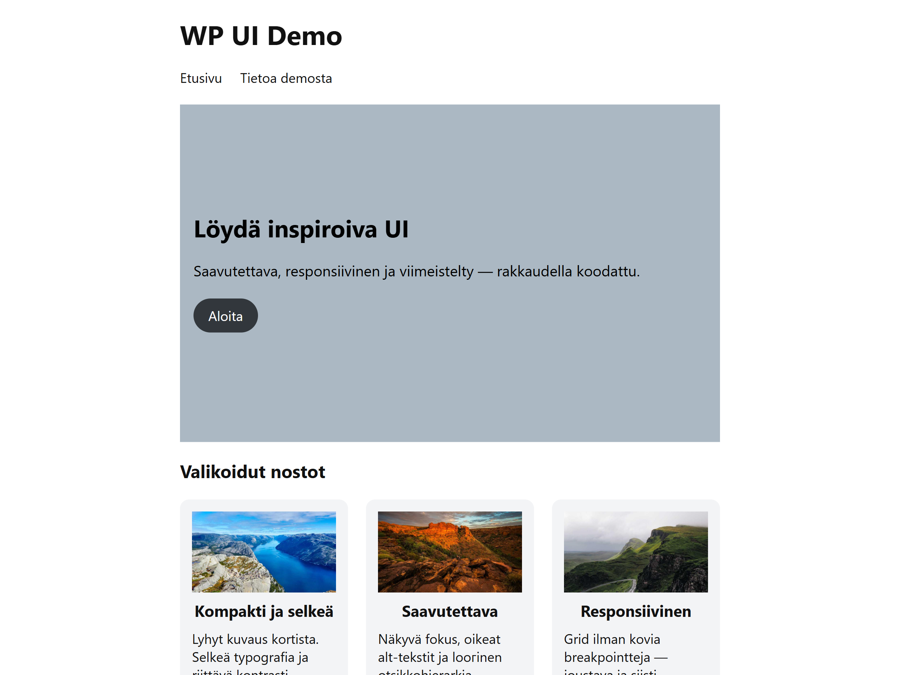
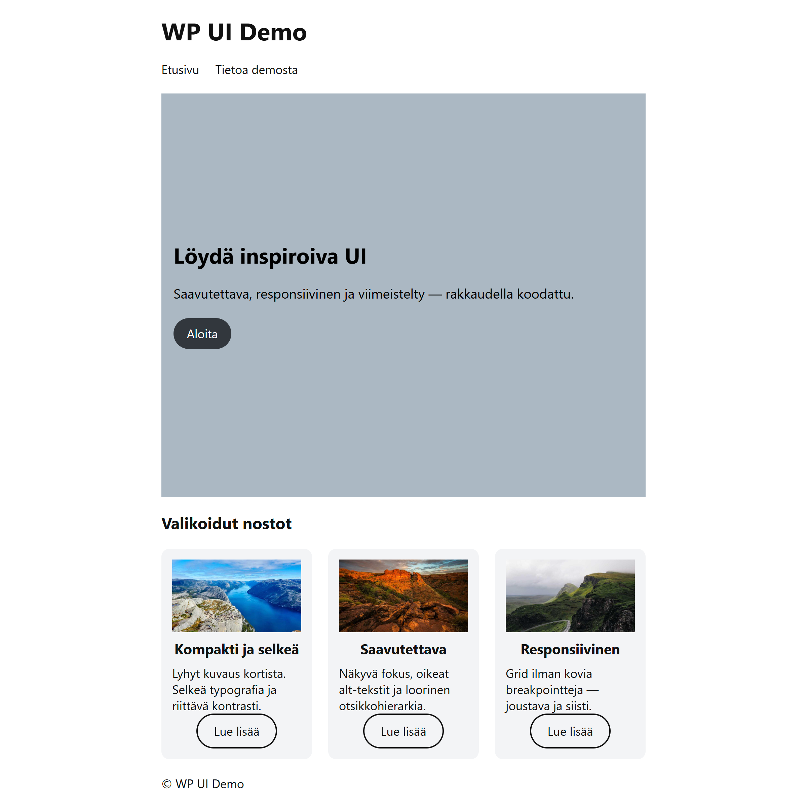

# WP UI Demo — WordPress Block Theme

Hero + Cards demo theme for WordPress 6.5+. Focus on accessibility (A11y) and clean UI.

## Highlights
- **A11y**: visible focus, skip link, semantic landmarks, proper alt/headings (A11y = 100)
- **Responsive**: CSS Grid (auto-fit/minmax), equal-height cards, button pinned to bottom
- **Performance basics**: lazy images (except first, if needed), minimal dependencies
- **Gutenberg**: block theme + patterns (Hero, Cards), list semantics for cards (`<ul><li>`)

## Install
1. Copy `wpui-demo` to `wp-content/themes/`.
2. Activate in **Appearance → Themes**.
3. Open **Site Editor** and place patterns (Hero, Cards) on the “Demo” page.

## Screenshots
**Theme preview:**  

**Full page (desktop):**  

## Notes
- Tested locally on WP 6.5+, PHP 8.1+.
- Lighthouse (mobile) fluctuates on localhost; typical Perf ~80–90, A11y 100.

## License
MIT
